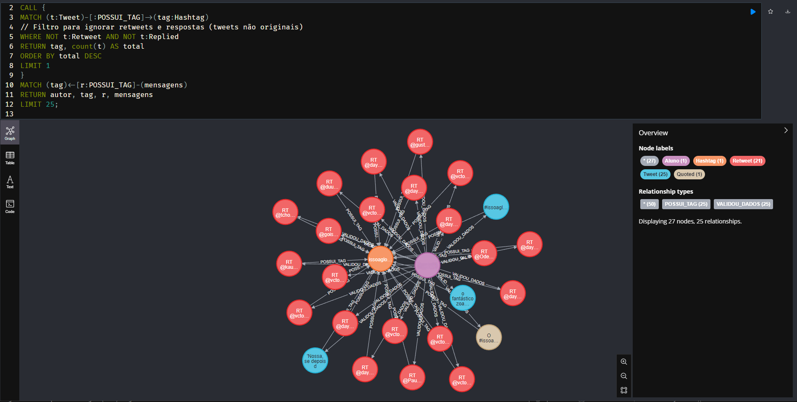

# 📊 Análise de Dados de Rede Social com Neo4j

Análise de dados de redes sociais utilizando Neo4j e Cypher para modelar relações entre usuários, tweets, retweets, respostas, citações e hashtags a partir de dados JSON.

## 🎯 Objetivo

Construir um modelo de dados capaz de representar as relações existentes em uma rede social, incluindo publicações originais, retweets, respostas, citações e hashtags.

A estrutura em grafo permite explorar essas conexões diretamente por meio dos relacionamentos entre os nós, facilitando consultas sobre padrões presentes no conjunto de dados.

## 🛠️ Tecnologias Utilizadas

- Neo4j — banco de dados orientado a grafos
- Cypher — criação, manipulação e consulta do grafo
- APOC — carregamento e processamento dos arquivos JSON
- JSON — formato dos dados utilizados na análise

## 🕸️ Modelagem do Grafo



Os dados foram representados por diferentes tipos de nós de acordo com o papel de cada entidade no conjunto analisado.

### Nós

- `User`
- `Tweet`
- `Retweet`
- `Reply`
- `Quote`
- `Hashtag`

### Relacionamentos

```text
(User)-[:POSTOU]->(Tweet)

(User)-[:RETUITOU]->(Retweet)

(User)-[:RESPONDEU]->(Reply)

(User)-[:CITOU]->(Quote)

(Tweet)-[:POSSUI_HASHTAG]->(Hashtag)
```

Essa estrutura permite navegar pelas conexões entre usuários, publicações, interações e hashtags sem depender de múltiplas junções entre tabelas.

## 📥 Importação dos Dados

Os dados são carregados a partir de arquivos JSON utilizando os procedimentos disponibilizados pela biblioteca **APOC**.

Exemplo simplificado da importação:

```cypher
CALL apoc.load.json("file:///tweets.json")
YIELD value

MERGE (u:User {id: value.user.id})
MERGE (t:Tweet {id: value.id})
MERGE (u)-[:POSTOU]->(t)
```

A importação transforma os dados originalmente estruturados em JSON em nós e relacionamentos que podem ser explorados diretamente pelo Neo4j.

## 🔎 Análises Realizadas

Após a construção do grafo, consultas em Cypher foram utilizadas para explorar padrões presentes nos dados.

### Hashtag presente nas mensagens originais

Uma das análises buscou identificar a hashtag presente em todas as mensagens originais do conjunto de dados.

**Resultado:** `#issoaglobonaomostra`

### Dispositivos utilizados nas publicações

Também foram analisadas as plataformas utilizadas para realizar as publicações associadas às hashtags estudadas.

A consulta mostrou uma predominância de postagens realizadas por **dispositivos móveis**, principalmente Android e iPhone.

## 🧠 Decisões de Modelagem

A utilização do Neo4j permite representar explicitamente as conexões existentes entre as entidades da rede social.

Em vez de armazenar apenas registros isolados, o modelo mantém relações como:

```text
Usuário → publicação → hashtag
Usuário → resposta → publicação
Usuário → retweet → publicação
Usuário → citação → publicação
```

Essa abordagem torna possível percorrer e consultar relacionamentos diretamente, característica especialmente útil para dados altamente conectados, como interações em redes sociais.

## 📂 Estrutura do Projeto

```text
neo4j-twitter-graph-analysis/
│
├── queries/       # Consultas Cypher utilizadas no projeto
├── imagens/       # Resultados e visualizações do grafo
└── README.md
```

## 👩‍💻 Autora

**Ana Julia Alves Dias**
